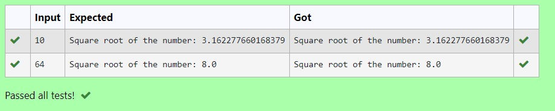

# Find the square root of a number

## AIM:
To write a program to find the square root of a number.

## Equipments Required:
1. Hardware – PCs
2. Anaconda – Python 3.7 Installation / Moodle-Code Runner

## Algorithm
1. Define a function.
2. Assign number = 10 in the function to perform 10 iteratios.
3. Set b = x.
4. Calculate  number = 0.5 * (x + b / x) for 10 iterations.
5. Return number

## Program:
```
/*
Program to find the square root for the given number(newton's method) using function.
Developed by: Keerthika
RegisterNumber: 21000385 
*/
def fun(x):
    for i in range(10):
        x=0.5*(x+b/x)
    print("Square root of the number:",x)
x=int(input())
b=x
fun(x)
```

## Output:



## Result:
Thus the program to find the square root for the given number(newton's method) using function is written and verified using python programming.
